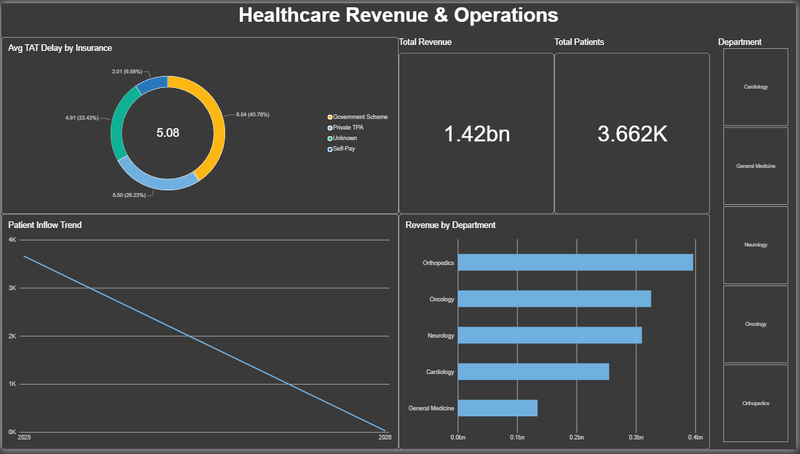

# 🏥 Healthcare Analytics & Operations Dashboard

## 📌 Project Overview
This end-to-end data analytics project focuses on evaluating hospital performance, optimizing turnaround times (TAT), and tracking NABH compliance (30-day readmissions). The data pipeline was built from scratch, handling data generation, SQL transformations, and interactive Power BI visualizations.

## 🛠️ Tech Stack Used
* **Python (Pandas):** Generated 10,000+ rows of synthetic healthcare records to bypass standard Excel date corruption issues.
* **MySQL:** Stored, cleaned, and manipulated the data.
* **Power BI:** Developed DAX measures and built the interactive dashboard.

## 💡 Key Business Problems Solved
1. **NABH 30-Day Readmission Tracking:** 
   * Used advanced SQL **CTEs** and **LAG() Window Functions** to track patient history and identify negative discharge gaps, ensuring compliance with NABH guidelines.
2. **Turnaround Time (TAT) Delay Bottlenecks:**
   * Calculated precise hourly delays between doctor discharge orders and actual physical discharge using `TIMESTAMPDIFF()`.
   * *Insight:* Discovered that 'Government Scheme' insurance types faced the highest average clearance delays (approx 5.1 hours).
3. **Revenue & Departmental Performance:**
   * Utilized `GROUP BY` and Aggregate functions (`SUM`, `AVG`, `COUNT`) to track a total revenue of 1.42 Billion INR across 3.6K+ unique patients.

## 📂 Files in this Repository
* `Healthcare_Queries.sql`: Contains the complete SQL code (ETL, Readmissions, TAT logic, and Aggregations).
* `Hospital_Analytics.pbix`: The Power BI dashboard file.
* `Final_SQL_Ready_Data.txt`: The raw synthetic dataset used for this project.

## 🚀 How to Use
1. Import the `.txt` file into your MySQL local server using `LOAD DATA INFILE`.
2. Run the queries in the `.sql` file to view the analysis.
3. Open the `.pbix` file in Power BI Desktop to interact with the dashboard.
